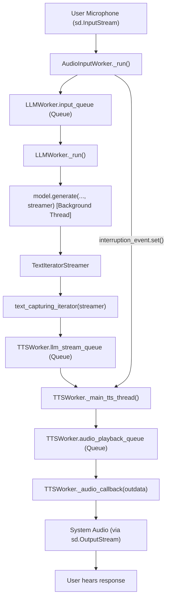
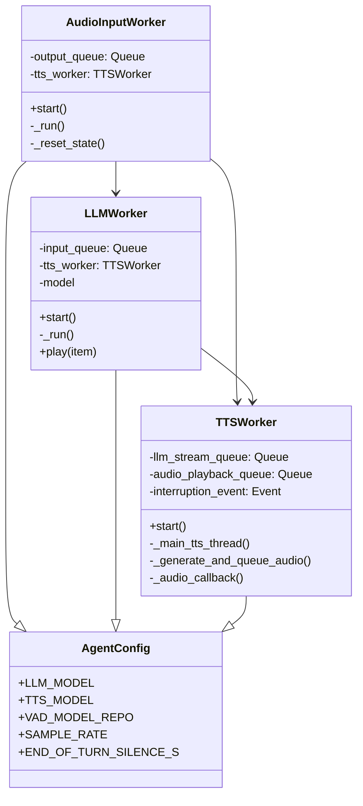
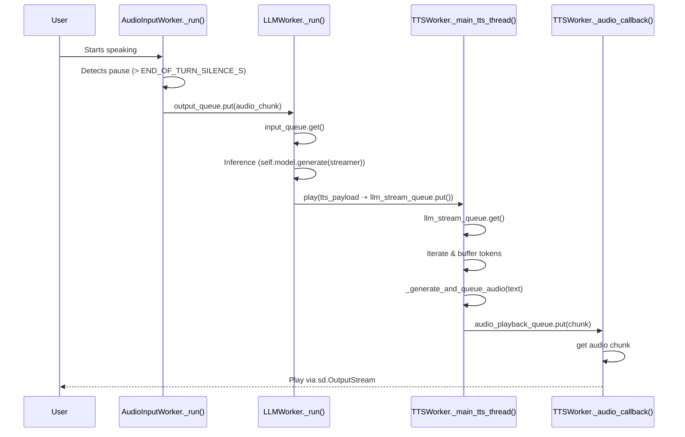
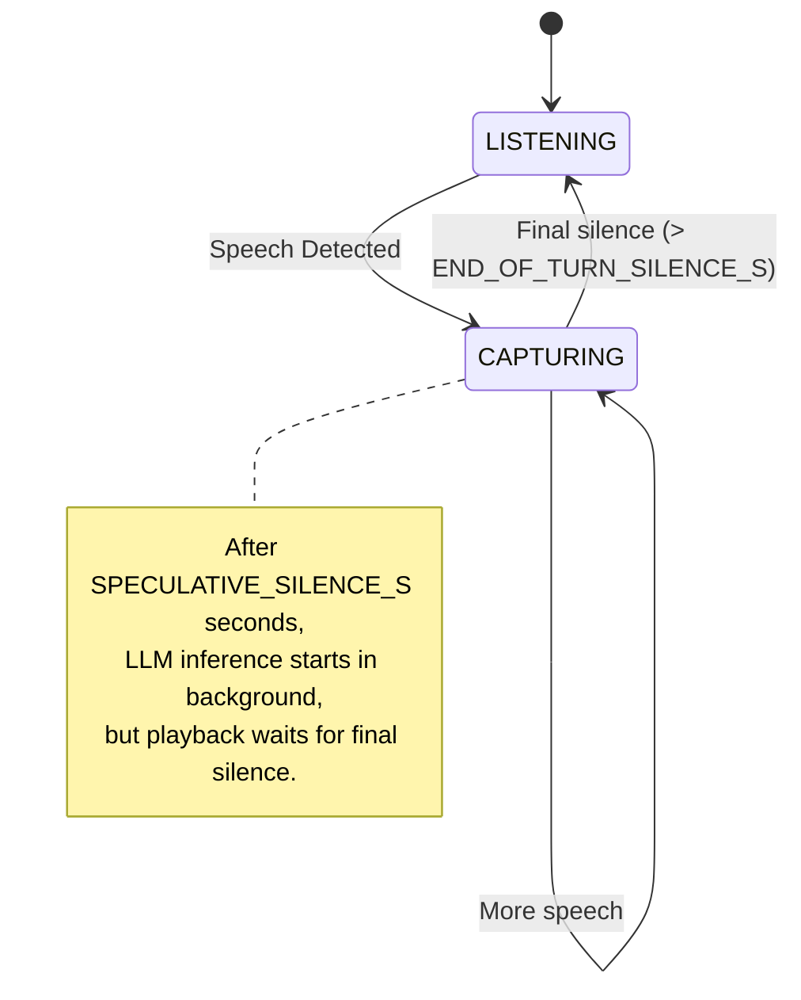
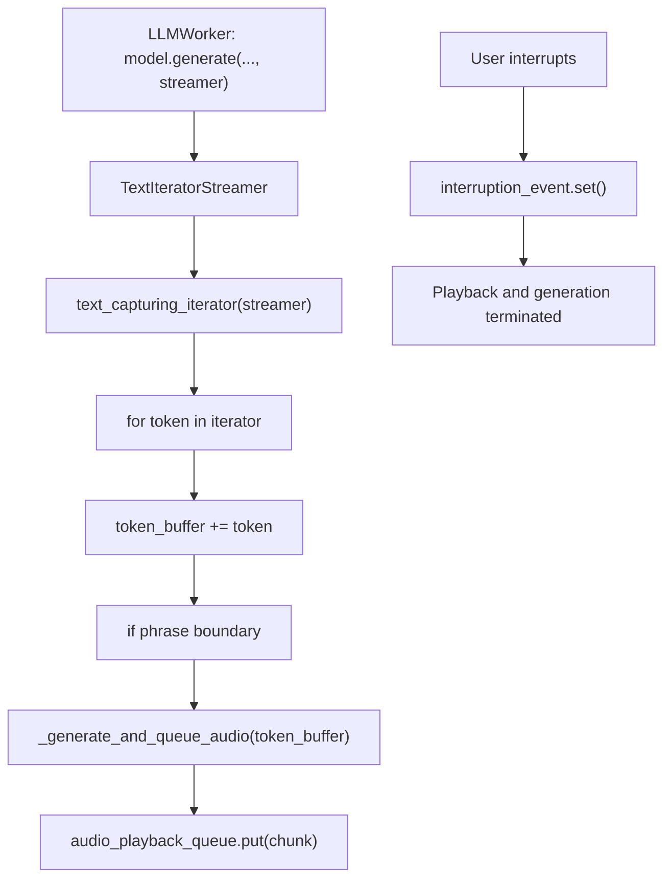
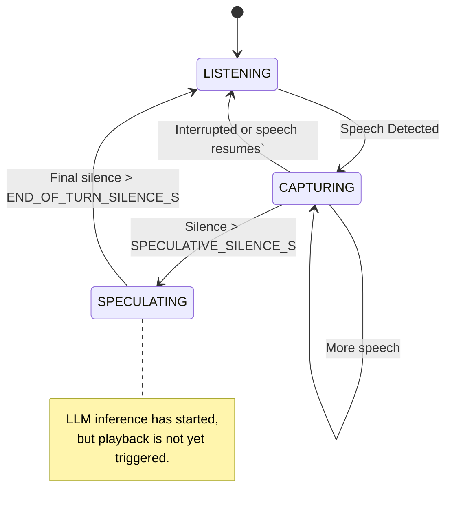

## Core Thread Architecture

This diagram shows which threads operate independently, what queues they watch or feed, and where parallelism enables low-latency performance.

```mermaid
    flowchart TD

    subgraph AudioInputWorker Thread
        A1["AudioInputWorker._run()"]
        A1 --> Q1["→ LLMWorker.input_queue.put(audio_chunk)"]
    end

    subgraph LLMWorker Thread
        B1["LLMWorker._run()"]
        B1 --> B2["model.generate(..., streamer) [Background Thread]"]
        B2 --> Q2["→ TTSWorker.play(tts_payload)"]
    end

    subgraph TTSWorker Thread
        C1["TTSWorker._main_tts_thread()"]
        C1 --> C2["_generate_and_queue_audio(text)"]
        C2 --> Q3["→ audio_playback_queue.put(chunk)"]
    end

    subgraph Audio Callback Thread
        D1["TTSWorker._audio_callback(outdata, ...)"]
        D1 --> Speaker["sd.OutputStream (speaker thread)"]
    end
```

- AudioInputWorker.\_run() detects voice activity and places audio on input_queue
- LLMWorker.\_run() processes audio and spawns generate() in a background thread
- TTSWorker.play() receives tts_payload and queues it for speech synthesis
- TTSWorker.\_main_tts_thread() handles buffering, synthesis, and queuing playback
- sd.OutputStream calls \_audio_callback() to play buffered audio via callback_buffer

## Execution Pipeline: Audio to Speech

This flow diagram traces how audio is transformed into spoken output using streaming token generation and real-time synthesis.

### Key Code References

| Component | Code Reference | Role |
| AudioInputWorker | AudioInputWorker.\_run() | Detects speech, sends chunks |
| LLMWorker | LLMWorker.\_run() | Prepares tokens via model.generate(...) |
| TextIteratorStreamer | Wrapped in text_capturing_iterator | Streams tokens to TTS |
| llm_stream_queue | TTSWorker.llm_stream_queue | Signals new speaking turn |
| audio_playback_queue | TTSWorker.audio_playback_queue | Buffers synthesized audio |
| interruption_event | TTSWorker.interruption_event | Interrupts generation and playback |
| callback_buffer | TTSWorker.callback_buffer | Final staging area before playback |
| sd.OutputStream | Starts in \_main_tts_thread() | Pulls audio frames via callback |

## Class Responsibilities

The following class relationships highlight dependency injection, shared config, and queue references.

### Clarified Purpose

- AgentConfig provides global configuration
- All worker classes use queues for thread-safe data sharing
- TTSWorker is shared across the system to unify synthesis

- LLMWorker.input_queue and TTSWorker.llm_stream_queue are the two coordination points between perception and speech.
- AgentConfig enforces consistency across modules — sample rate, model paths, etc.
- Thread separation enables parallel voice response without blocking recognition.

## Sequence of Execution

This shows how each part activates and hands off responsibility. Useful for tracing performance or debugging latency.

### Precise Execution Points

| Stage | Code |
| VAD Decision | AudioInputWorker.\_run() triggers on silence |
| LLM Thread Start | Thread(target=generate, ...) |
| TTS Coordination | TTSWorker.play(...) ➝ Queue |
| Audio Synthesis | TTSWorker.\_generate_and_queue_audio() |
| Audio Playback | TTSWorker.\_audio_callback() |

## Voice Detection States

Shows how speculative vs committed turn transitions work.

## Streaming, Phrase-Flushing, and Interrupts

Streaming tokens directly into speech is central to responsiveness. Interrupts allow mid-sentence cancellation.

- Phrase flushing triggered via punctuation or token count
- First audio chunk timestamped to measure responsiveness
- Audio stream ends gracefully via audio_playback_queue.put(None)

## Voice Detection and Speculative Inference

This diagram shows how early inference starts before speech ends.

### Relevant Code Anchors

| Variable | File | Role |
| SPECULATIVE_SILENCE_S | AgentConfig | Starts early token generation |
| END_OF_TURN_SILENCE_S | AgentConfig | Confirms true end of user speech |
| interruption_event | TTSWorker | Cancels synthesis and playback |
| first_audio_chunk_queued_time | \_generate_and_queue_audio() | Measures model → speech latency |

### Relevant Variables

| Variable | Purpose |
| AgentConfig.SPECULATIVE_SILENCE_S | Starts speculative generation |
| AgentConfig.END_OF_TURN_SILENCE_S | Confirms final turn handoff |
| AudioInputWorker.is_speaking | Checked by TTSWorker to decide if playback is allowed |
| interruption_event | Used to halt generation and audio synthesis during overlapping speech |

### Component Summary

| Component | Method / Object | Role |
| AudioInputWorker | \_run() | Detects voice, triggers LLM |
| LLMWorker | \_run() → generate() | Streams tokens |
| TTSWorker | play() → \_main_tts_thread() | Synthesizes speech |
| sd.OutputStream | Callback to \_audio_callback() | Delivers audio |
| text_capturing_iterator | Wraps token stream | Adds timing markers |
| audio_playback_queue | Queue | Buffers chunks for playback |
| callback_buffer | np.ndarray | Staging area for speaker feed |
